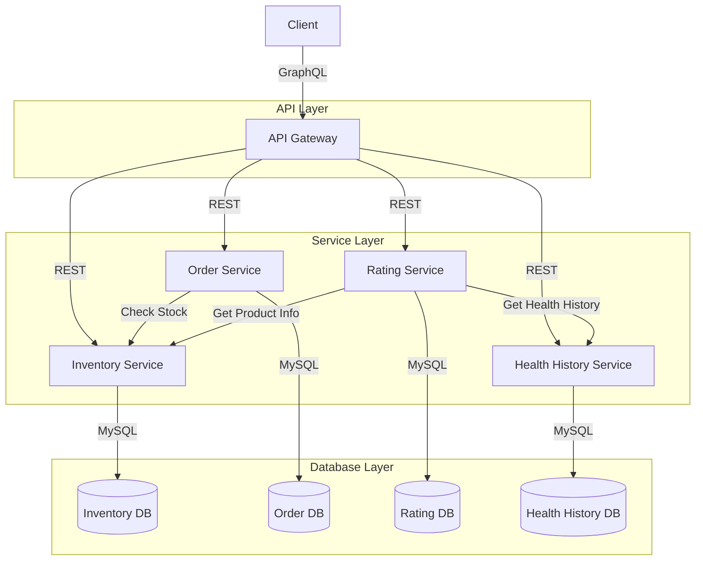

# ePharma - Sistem Farmasi Terintegrasi

## Deskripsi
ePharma adalah sistem farmasi terintegrasi yang menggunakan arsitektur microservices. Sistem ini terdiri dari beberapa layanan yang saling terintegrasi untuk mengelola operasi farmasi secara efisien.

## Arsitektur Sistem

### Diagram Integrasi


### Penjelasan Arsitektur
1. **API Layer**
   - API Gateway sebagai single entry point
   - GraphQL untuk komunikasi data
   - Load balancing dan routing

2. **Service Layer**
   - Microservices terpisah
   - Komunikasi via REST API
   - Setiap service memiliki database sendiri

3. **Database Layer**
   - Database terpisah per service
   - Isolasi data
   - Optimasi performa

## Desain Skema GraphQL

### Schema Design
```graphql
type Obat {
  id: Int!
  nama_obat: String!
  stok: Int!
  rating: Float
  rekomendasi: String
}

type Pesanan {
  id: Int!
  nama_pemesan: String!
  jumlah: Int!
  status: String!
  obat: Obat!
}

type HealthHistory {
  id: Int!
  nama: String!
  status: String!
  created_at: String!
}

type Rating {
  id: Int!
  obat_id: Int!
  rating: Float!
  komentar: String
  created_at: String!
}

type Query {
  # Inventory Queries
  obat: [Obat!]!
  obatById(id: Int!): Obat
  
  # Order Queries
  pesanan: [Pesanan!]!
  pesananById(id: Int!): Pesanan
  
  # Health History Queries
  healthHistory: [HealthHistory!]!
  healthHistoryByNama(nama: String!): [HealthHistory!]!
  
  # Rating Queries
  ratings: [Rating!]!
  ratingsByObatId(obat_id: Int!): [Rating!]!
}

type Mutation {
  # Inventory Mutations
  tambahObat(nama_obat: String!, stok: Int!): Obat!
  updateStok(id: Int!, stok: Int!): Obat!
  
  # Order Mutations
  buatPesanan(nama_pemesan: String!, obat_id: Int!, jumlah: Int!): Pesanan!
  updateStatusPesanan(id: Int!, status: String!): Pesanan!
  
  # Health History Mutations
  tambahHealthHistory(nama: String!, status: String!): HealthHistory!
  
  # Rating Mutations
  tambahRating(obat_id: Int!, rating: Float!, komentar: String): Rating!
}
```

### Contoh Query
```graphql
# Mendapatkan semua obat dengan rating
query {
  obat {
    id
    nama_obat
    stok
    rating
    rekomendasi
  }
}

# Mendapatkan pesanan dengan detail obat
query {
  pesanan {
    id
    nama_pemesan
    jumlah
    status
    obat {
      nama_obat
      stok
    }
  }
}

# Mendapatkan riwayat kesehatan dan rekomendasi
query {
  healthHistoryByNama(nama: "John Doe") {
    status
    created_at
  }
  ratings {
    obat_id
    rating
    komentar
  }
}
```

## Integrasi Lintas Kelompok

### 1. Order Service ↔ Inventory Service
- **Alur Integrasi**:
  1. Order Service memeriksa stok di Inventory Service
  2. Jika stok tersedia, pesanan dibuat
  3. Inventory Service memperbarui stok
  4. Order Service memperbarui status pesanan

- **Endpoint yang Digunakan**:
  ```http
  GET http://inventory-service:5002/api/obat/{id}
  PUT http://inventory-service:5002/api/obat/{id}/stok
  ```

### 2. Rating Service ↔ Inventory Service
- **Alur Integrasi**:
  1. Rating Service mengambil informasi obat
  2. Menghitung rating rata-rata
  3. Menghasilkan rekomendasi menggunakan AI
  4. Memperbarui informasi obat

- **Endpoint yang Digunakan**:
  ```http
  GET http://inventory-service:5002/api/obat
  PUT http://inventory-service:5002/api/obat/{id}/rating
  ```

### 3. Health History Service ↔ Rating Service
- **Alur Integrasi**:
  1. Rating Service mengambil riwayat kesehatan
  2. Menganalisis pola kesehatan
  3. Menghasilkan rekomendasi personalisasi
  4. Memperbarui rating dan rekomendasi

- **Endpoint yang Digunakan**:
  ```http
  GET http://health-history-service:5006/api/health-history/nama/{nama}
  POST http://rating-service:5005/api/ratings/recommend
  ```

### Mekanisme Integrasi
1. **Synchronous Communication**
   - REST API untuk komunikasi langsung
   - Response time yang cepat
   - Error handling yang robust

2. **Data Consistency**
   - Validasi data di setiap service
   - Transaction management
   - Error rollback

3. **Error Handling**
   - Retry mechanism
   - Circuit breaker pattern
   - Fallback responses

4. **Monitoring**
   - Logging terpusat
   - Performance metrics
   - Error tracking

## Teknologi yang Digunakan

### Teknologi Wajib
- **Docker**: Digunakan untuk containerisasi semua layanan
- **GraphQL**: Sebagai API layer untuk komunikasi data antar layanan
- **Database**: MySQL untuk setiap layanan (1 layanan 1 database)
- **Framework**: Flask (Python) untuk semua layanan

## Struktur Sistem

### Layanan (Microservices)

1. **Inventory Service** (`/inventory_service`)
   - Port: 5002
   - Database: MySQL (inventory_db)
   - Fungsi: Mengelola stok obat dan inventori farmasi
   - Endpoint: `/api/obat`

2. **Order Service** (`/order_service`)
   - Port: 5003
   - Database: MySQL (order_db)
   - Fungsi: Mengelola pemesanan obat
   - Endpoint: `/api/orders`
   - Integrasi: Menggunakan data dari Inventory Service

3. **Rating Service** (`/rating_service`)
   - Port: 5005
   - Database: MySQL (rating_db)
   - Fungsi: Mengelola rating dan rekomendasi obat
   - Endpoint: `/api/ratings`
   - Fitur: Menggunakan Gemini AI untuk rekomendasi

4. **Health History Service** (`/health_history_service`)
   - Port: 5006
   - Database: MySQL (health_history_db)
   - Fungsi: Mencatat riwayat kesehatan pengguna
   - Endpoint: `/api/health-history`

5. **API Gateway** (`/api_gateway`)
   - Port: 5000
   - Fungsi: Menyediakan GraphQL interface untuk semua layanan
   - Endpoint: `/graphql`

### Integrasi Antar Layanan

1. **GraphQL API**
   - Semua layanan dapat diakses melalui GraphQL di API Gateway
   - Endpoint: `http://localhost:5000/graphql`
   - Query yang tersedia:
     ```graphql
     query {
       obat {
         id
         nama_obat
         stok
       }
       pesanan {
         id
         nama_pemesan
         jumlah
         status
       }
     }
     ```

2. **Integrasi Lintas Layanan**
   - Order Service ↔ Inventory Service: Pemesanan mempengaruhi stok
   - Rating Service ↔ Inventory Service: Rating mempengaruhi rekomendasi obat
   - Health History Service ↔ Rating Service: Riwayat kesehatan mempengaruhi rekomendasi

## Cara Menjalankan Sistem

1. **Persiapan**
   ```bash
   # Clone repository
   git clone [repository-url]
   cd ePharma
   ```

2. **Menjalankan dengan Docker**
   ```bash
   # Build dan jalankan semua container
   docker-compose up --build
   ```

3. **Akses Layanan**
   - API Gateway: http://localhost:5000/graphql
   - PHPMyAdmin: http://localhost:8081
   - Inventory Service: http://localhost:5002
   - Order Service: http://localhost:5003
   - Rating Service: http://localhost:5005
   - Health History Service: http://localhost:5006

## Dokumentasi API

### GraphQL API (API Gateway)
- Endpoint: `http://localhost:5000/graphql`
- Menggunakan GraphiQL untuk testing dan dokumentasi
- Mendukung query untuk semua layanan

### REST API
Setiap layanan menyediakan REST API dengan dokumentasi di folder masing-masing:
- Inventory Service: `/inventory_service/README.md`
- Order Service: `/order_service/README.md`
- Rating Service: `/rating_service/README.md`
- Health History Service: `/health_history_service/README.md`

## Spesifikasi Teknis

### Database
- Menggunakan MySQL untuk semua layanan
- Setiap layanan memiliki database terpisah
- Konfigurasi database di `docker-compose.yml`

### Container
- Semua layanan di-containerisasi menggunakan Docker
- Konfigurasi container di `docker-compose.yml`
- Volume untuk persistence data

### Network
- Semua layanan terhubung dalam network `epharma-network`
- Port mapping yang terorganisir
- Isolasi network untuk keamanan

