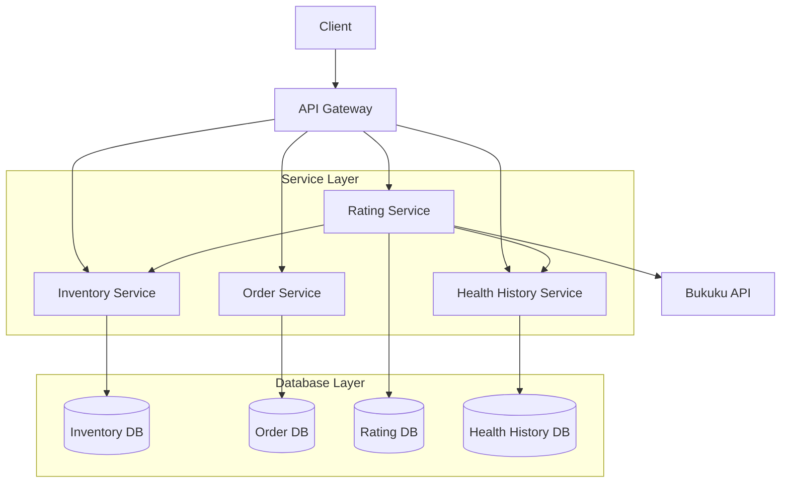
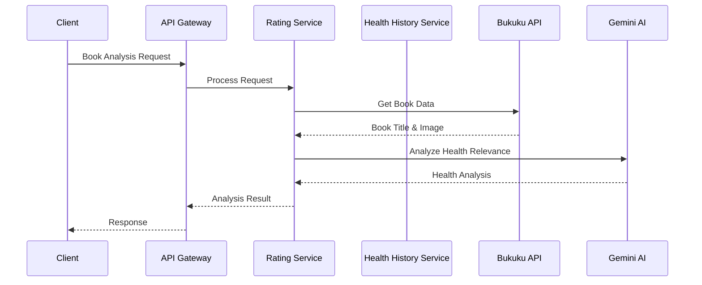

# ePharma - Sistem Farmasi Terintegrasi

**Sistem farmasi modern dengan arsitektur microservices**

[](https://www.docker.com/)
[](https://graphql.org/)
[](https://www.mysql.com/)
[](https://flask.palletsprojects.com/)

---

## Daftar Isi

- [Tentang Proyek](#tentang-proyek)
- [Arsitektur](#arsitektur)
- [Microservices](#microservices)
- [GraphQL Schema](#graphql-schema)
- [Integrasi Antar Layanan](#integrasi-antar-layanan)
- [Quick Start](#quick-start)
- [API Documentation](#api-documentation)

---

## Tentang Proyek

ePharma adalah sistem farmasi yang dibangun dengan arsitektur microservices. Sistem ini mengelola inventori obat, pemesanan, rating, dan riwayat kesehatan pengguna.

### Fitur Utama

- **Manajemen Inventori** - Kelola stok obat real-time
- **Sistem Pemesanan** - Proses order terintegrasi
- **Rating & Review** - Penilaian dengan AI recommendation
- **Riwayat Kesehatan** - Tracking health history
- **AI Book Analysis** - Analisis buku kesehatan menggunakan AI dari data Bukuku API

---

## Arsitektur



### Komponen Arsitektur

| Layer | Fungsi | Teknologi |
|-------|--------|-----------|
| **API Layer** | Single entry point, GraphQL interface | Flask + GraphQL |
| **Service Layer** | Microservices dengan komunikasi REST | Flask + REST API |
| **Database Layer** | Database terpisah per service | MySQL |

---

## Microservices

| Service | Port | Database | Fungsi |
|---------|------|----------|--------|
| **API Gateway** | 5000 | - | GraphQL interface |
| **Inventory Service** | 5002 | inventory_db | Manajemen stok obat |
| **Order Service** | 5003 | order_db | Pemrosesan pesanan |
| **Rating Service** | 5005 | rating_db | Rating & AI book analysis |
| **Health History** | 5006 | health_history_db | Riwayat kesehatan |

### Endpoint Utama

```
http://localhost:5000/graphql          # API Gateway
http://localhost:5002/api/obat         # Inventory
http://localhost:5003/api/orders       # Orders
http://localhost:5005/api/ratings      # Ratings
http://localhost:5006/api/health-history # Health History
```

---

## GraphQL Schema

### Type Definitions

```graphql
type Obat {
  id: Int!
  namaObat: String!
  stok: Int!
  namaKategori: String!
}

type HealthHistory {
  id: Int!
  nama: String!
  status: String!
  created_at: String!
}

type Rating {
  id: Int!
  obat_id: Int!
  rating: Float!
  komentar: String
  created_at: String!
}

type BookAnalysis {
  id: Int!
  title: String!
  image_url: String!
  is_health_related: Boolean!
  health_description: String!
  confidence_score: Float!
}
```

### Sample Queries

```graphql
# Get all medicines
query {
  obat {
    id
    namaObat
    stok
  }
}

# Analyze books from Bukuku API
query {
  analyzeBooks {
    title
    image_url
    is_health_related
    health_description
    confidence_score
  }
}

# Analyze specific book
mutation {
  analyzeBook(
    title: "Judul Buku dari Bukuku API"
    image_url: "https://bukuku.com/image.jpg"
  ) {
    is_health_related
    health_description
    confidence_score
  }
}
```

---

## Integrasi Antar Layanan

### Service Communication



### Integration Patterns

| Pattern | Service A | Service B | Purpose |
|---------|-----------|-----------|---------|
| **Book Analysis** | Rating Service | Bukuku API | Analisis buku kesehatan dari API Bukuku |
| **AI Integration** | Rating Service | Gemini AI | Analisis deskripsi relevansi kesehatan |
| **Stock Management** | Order Service | Inventory Service | Validasi dan update stok |


## Quick Start

### Prerequisites

- Docker & Docker Compose
- Python 3.8+

### Installation

```bash
# Clone repository
git clone <repository-url>
cd ePharma

# Run with Docker
docker-compose up --build

# Wait for all services to be ready (~2-3 minutes)
```

### Access Points

| Service | URL | Description |
|---------|-----|-------------|
| **GraphQL API** | http://localhost:5000/graphql | Main API interface |
| **PHPMyAdmin** | http://localhost:8081 | Database management |
| **Inventory** | http://localhost:5002 | Direct inventory access |
| **Orders** | http://localhost:5003 | Direct order access |

---

## API Documentation

### GraphQL Playground

Access GraphQL Playground at `http://localhost:5000/graphql` for:

- Interactive schema exploration
- Query testing
- Real-time documentation

### Technology Stack

| Component | Technology | Purpose |
|-----------|------------|---------|
| **Containerization** | Docker | Service isolation |
| **API** | GraphQL | Unified data layer |
| **Database** | MySQL | Data persistence |
| **Backend** | Flask | Web framework |
| **AI** | Gemini AI | Analisis relevansi kesehatan |
| **External API** | Bukuku API | Data buku (title, image) |

---

### Database Configuration

```yaml
# docker-compose.yml
services:
  mysql:
    image: mysql:8.0
    environment:
      MYSQL_ROOT_PASSWORD: root
    ports:
      - "3306:3306"
```

### Network Architecture

- All services connected via `epharma-network`
- Port mapping for external access
- Service discovery through Docker DNS

---

**Made for better healthcare management**
