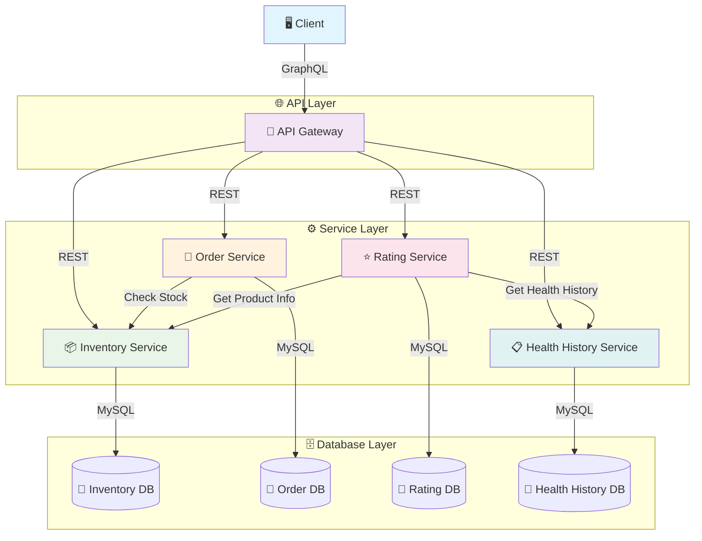
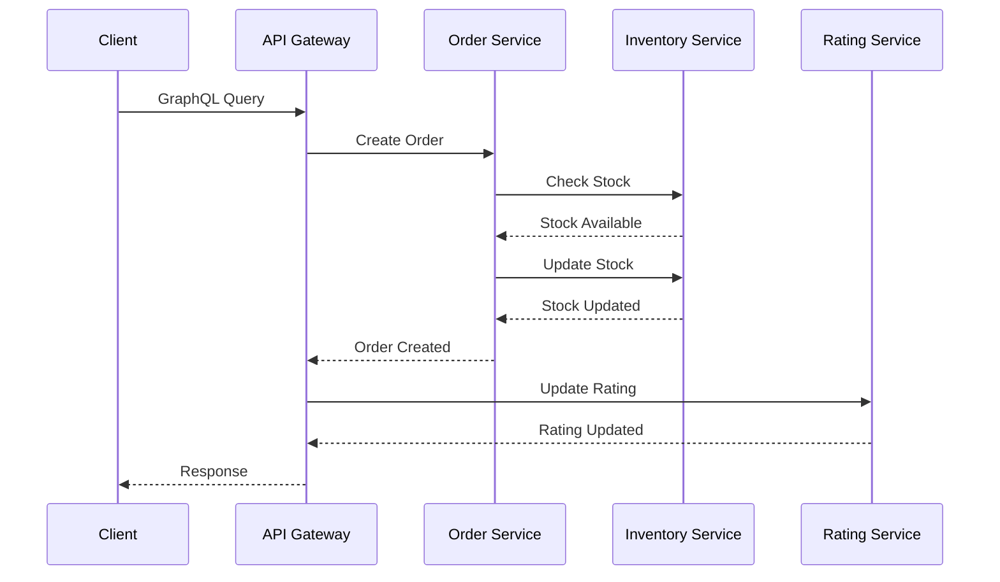

# 🏥 ePharma - Sistem Farmasi Terintegrasi

<div align="center">


**Sistem farmasi modern dengan arsitektur microservices yang terintegrasi**

[](https://www.docker.com/)
[](https://graphql.org/)
[](https://www.mysql.com/)
[](https://flask.palletsprojects.com/)
[](https://www.python.org/)

</div>

---

## 📋 Daftar Isi

- [🔍 Tentang Proyek](#-tentang-proyek)
- [🏗️ Arsitektur Sistem](#️-arsitektur-sistem)
- [🔧 Teknologi Stack](#-teknologi-stack)
- [🚀 Microservices](#-microservices)
- [📊 Schema GraphQL](#-schema-graphql)
- [🔄 Integrasi Antar Layanan](#-integrasi-antar-layanan)
- [⚡ Quick Start](#-quick-start)
- [📖 Dokumentasi API](#-dokumentasi-api)
- [🛠️ Spesifikasi Teknis](#️-spesifikasi-teknis)

---

## 🔍 Tentang Proyek

ePharma adalah sistem farmasi terintegrasi yang dibangun dengan arsitektur **microservices modern**. Sistem ini dirancang untuk mengelola operasi farmasi secara efisien dengan berbagai layanan yang saling terintegrasi.

### ✨ Fitur Utama

- 💊 **Manajemen Inventori** - Kelola stok obat secara real-time
- 📦 **Sistem Pemesanan** - Proses order yang terintegrasi
- ⭐ **Rating & Review** - Sistem penilaian dengan AI recommendation
- 📋 **Riwayat Kesehatan** - Tracking health history pengguna
- 🔗 **GraphQL API** - Single endpoint untuk semua layanan

---

## 🏗️ Arsitektur Sistem

<div align="center">



</div>

### 🔧 Penjelasan Arsitektur

| Layer | Fungsi | Teknologi |
|-------|--------|-----------|
| **🌐 API Layer** | Single entry point, GraphQL interface | Flask + GraphQL |
| **⚙️ Service Layer** | Microservices terpisah dengan komunikasi REST | Flask + REST API |
| **🗄️ Database Layer** | Database terpisah per service untuk isolasi data | MySQL |

---

## 🔧 Teknologi Stack

<div align="center">

| Kategori | Teknologi | Deskripsi |
|----------|-----------|-----------|
| **Container** | 🐳 Docker | Containerisasi semua layanan |
| **API** | 🔗 GraphQL | Query language untuk API |
| **Database** | 🗄️ MySQL | Relational database untuk setiap service |
| **Backend** | 🐍 Flask | Python web framework |
| **Frontend** | 🌐 HTML | User interface |

</div>

---

## 🚀 Microservices

<div align="center">

| Service | Port | Database | Fungsi Utama |
|---------|------|----------|--------------|
| 🚪 **API Gateway** | `5000` | - | GraphQL interface |
| 📦 **Inventory Service** | `5002` | `inventory_db` | Manajemen stok obat |
| 🛒 **Order Service** | `5003` | `order_db` | Pemrosesan pesanan |
| ⭐ **Rating Service** | `5005` | `rating_db` | Rating & AI recommendation |
| 📋 **Health History** | `5006` | `health_history_db` | Riwayat kesehatan |

</div>

### 📍 Endpoint Detail

```bash
# API Gateway
http://localhost:5000/graphql

# Individual Services
http://localhost:5002/api/obat          # Inventory
http://localhost:5003/api/orders        # Orders
http://localhost:5005/api/ratings       # Ratings
http://localhost:5006/api/health-history # Health History
```

---

## 📊 Schema GraphQL

### 🏷️ Type Definitions

```graphql
type Obat {
  id: Int!
  namaObat: String!
  stok: Int!
  namaKategori: String!
}

type HealthHistory {
  id: Int!
  nama: String!
  status: String!
  created_at: String!
}

type Rating {
  id: Int!
  obat_id: Int!
  rating: Float!
  komentar: String
  created_at: String!
}
```

### 🔍 Query Examples

<details>
<summary><strong>📦 Inventory Queries</strong></summary>

```graphql
# Get all medicines
query {
  obat {
    id
    namaObat
    stok
    namaKategori
  }
}

# Get medicine by ID
query {
  obatById(id: 1) {
    namaObat
    stok
  }
}
```

</details>

<details>
<summary><strong>🛒 Order Queries</strong></summary>

```graphql
# Get all orders
query {
  pesanan {
    id
    nama_pemesan
    jumlah
    status
  }
}
```

</details>

<details>
<summary><strong>⭐ Rating & Health Queries</strong></summary>

```graphql
# Get health history and ratings
query {
  healthHistoryByNama(nama: "John Doe") {
    status
    created_at
  }
  ratings {
    obat_id
    rating
    komentar
  }
}
```

</details>

---

## 🔄 Integrasi Antar Layanan

### 🔗 Service Communication Flow



### 🔄 Integration Patterns

| Pattern | Service A | Service B | Purpose |
|---------|-----------|-----------|---------|
| **📋 Stock Check** | Order Service | Inventory Service | Validasi stok sebelum order |
| **⭐ Rating Update** | Rating Service | Inventory Service | Update rating obat |
| **🤖 AI Recommendation** | Rating Service | Health History | Rekomendasi personal |

---

## ⚡ Quick Start

### 🔧 Prerequisites

- 🐳 Docker & Docker Compose
- 🐍 Python 3.8+
- 🌐 Web Browser

### 🚀 Installation

```bash
# 1️⃣ Clone repository
git clone <repository-url>
cd ePharma

# 2️⃣ Build dan jalankan containers
docker-compose up --build

# 3️⃣ Tunggu semua service ready (±2-3 menit)
```

### 🌐 Access Points

| Service | URL | Description |
|---------|-----|-------------|
| 🔗 **GraphQL Playground** | http://localhost:5000/graphql | Main API interface |
| 🗄️ **PHPMyAdmin** | http://localhost:8081 | Database management |
| 📦 **Inventory API** | http://localhost:5002 | Direct inventory access |
| 🛒 **Order API** | http://localhost:5003 | Direct order access |

---

## 📖 Dokumentasi API

### 🔗 GraphQL Playground

Akses GraphQL Playground di `http://localhost:5000/graphql` untuk:

- 📝 **Interactive Documentation** - Explore schema secara interaktif
- 🧪 **Query Testing** - Test queries langsung di browser
- 📚 **Schema Explorer** - Browse semua available types dan fields

### 🛠️ Sample Mutations

<details>
<summary><strong>➕ Create Operations</strong></summary>

```graphql
# Add new medicine
mutation {
  tambahObat(nama_obat: "Paracetamol", stok: 100) {
    id
    namaObat
    stok
  }
}

# Create order
mutation {
  buatPesanan(nama_pemesan: "John Doe", obat_id: 1, jumlah: 5) {
    id
    status
  }
}

# Add rating
mutation {
  tambahRating(obat_id: 1, rating: 4.5, komentar: "Obat berkualitas") {
    id
    rating
  }
}
```

</details>

---

## 🛠️ Spesifikasi Teknis

### 🐳 Container Configuration

```yaml
# docker-compose.yml highlight
services:
  api-gateway:     # Port 5000 - GraphQL
  inventory:       # Port 5002 - REST API
  orders:          # Port 5003 - REST API
  ratings:         # Port 5005 - REST API + AI
  health-history:  # Port 5006 - REST API
  mysql:           # Port 3306 - Database
  phpmyadmin:      # Port 8081 - DB Management
```

### 📊 Database Schema

| Database | Tables | Purpose |
|----------|--------|---------|
| `inventory_db` | obat, kategori | Medicine inventory |
| `order_db` | pesanan, detail_pesanan | Order management |
| `rating_db` | rating, komentar | Reviews & ratings |
| `health_history_db` | riwayat_kesehatan | Health records |

---

<div align="center">

### 🌟 Contributing

Contributions are welcome! Please feel free to submit a Pull Request.

### 📄 License

This project is licensed under the MIT License.

---

**Made with ❤️ for better healthcare management by Aga**

</div>
